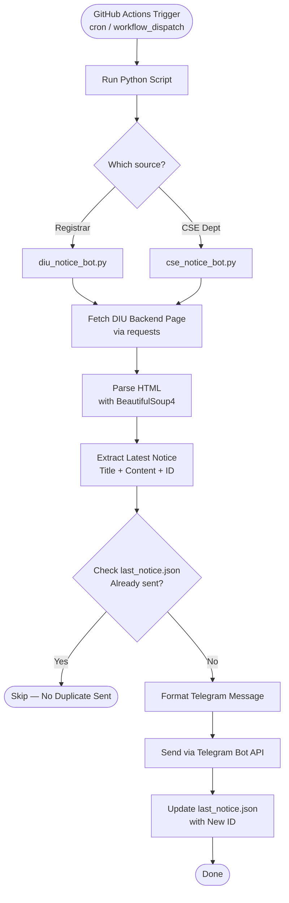

<div align="center">


# DIU Notice Bot

**Automated Telegram notifications for Daffodil International University notices**

[](https://python.org)
[](https://core.telegram.org/bots/api)
[](https://github.com/features/actions)
[](https://www.crummy.com/software/BeautifulSoup/)
[](LICENSE)
[](https://github.com)

A headless Python automation bot that monitors DIU notice pages and instantly delivers new notices to your Telegram channel — no browser, no GUI, no fuss.

</div>

---

## What It Does

DIU Notice Bot watches two official DIU notice sources and automatically pushes new notices to a Telegram channel the moment they appear. It runs fully headlessly via GitHub Actions on a scheduled cron job, uses lightweight HTTP requests instead of a browser, and never sends the same notice twice.

| Source | URL |
|---|---|
| Registrar Office | `webbackend.daffodilvarsity.edu.bd/registrar-office/all-forms` |
| CSE Department | `webbackend.daffodilvarsity.edu.bd/department-notice/cse` |

---

## How It Works



---

## Project Structure

```
diu-notice-bot/
├── diu_notice_bot.py          # Registrar Office notice checker
├── cse_notice_bot.py          # CSE Department notice checker
├── requirements.txt           # Python dependencies
├── last_notice.json           # State file — Registrar (last sent notice ID)
├── last_notice_cse.json       # State file — CSE (last sent notice ID)
└── .github/
    └── workflows/
        └── diu-notice-bot.yml # GitHub Actions workflow
```

---

## Tech Stack

| Component | Technology |
|---|---|
| Language | Python 3.12 |
| HTTP Requests | `requests` |
| HTML Parsing | `BeautifulSoup4` |
| Notifications | Telegram Bot API |
| Automation | GitHub Actions |
| Secrets Management | GitHub Repository Secrets |

---

## Features

- Monitors DIU Registrar Office and CSE Department notice boards
- Sends formatted notices directly to a Telegram channel
- Supports both **private** (numeric chat ID) and **public** (`@channel_username`) Telegram channels
- Prevents duplicate messages using persistent JSON state files
- Runs fully headless — no browser, no display, no Selenium
- Triggered automatically via cron schedule or manually via `workflow_dispatch`
- Compatible with Linux, WSL, and GitHub Actions environments

---

## Setup & Configuration

### 1. Fork or Clone This Repository

```bash
git clone https://github.com/your-username/diu-notice-bot.git
cd diu-notice-bot
```

### 2. Create a Telegram Bot

1. Open [@BotFather](https://t.me/BotFather) on Telegram
2. Send `/newbot` and follow the prompts
3. Copy your **Bot Token**
4. Add the bot to your channel as an **Administrator**
5. Set your `TELEGRAM_CHAT_ID`:
   - **Private channel:** numeric chat ID (e.g., `-1001234567890`)
   - **Public channel:** channel username (e.g., `@my_channel`)
   - **Also accepted:** channel link (e.g., `https://t.me/my_channel`)

### 3. Add GitHub Secrets

Go to your repository → **Settings** → **Secrets and variables** → **Actions** → **New repository secret**

| Secret Name | Value |
|---|---|
| `TELEGRAM_BOT_TOKEN` | Your bot token from BotFather |
| `TELEGRAM_CHAT_ID` | Private numeric chat ID, public `@channel_username`, or `https://t.me/channel` link |

### 4. Install Dependencies (for local testing)

```bash
pip install -r requirements.txt
```

### 5. Run Locally

```bash
python diu_notice_bot.py    # Check Registrar notices
python cse_notice_bot.py    # Check CSE Department notices
```

---

## GitHub Actions Workflow

The bot is triggered automatically by a cron schedule and can also be triggered manually.

```yaml
on:
  schedule:
    - cron: "*/5 * * * *"
  workflow_dispatch:
```

> **Note:** GitHub Actions cannot reliably run more frequently than every 5 minutes.  
> This is a platform-level limitation — even if you set a shorter interval (e.g., `*/1`),  
> GitHub does not guarantee execution every minute. **5 minutes is the practical minimum.**

---

## Security

> **Before making your repository public, review this checklist.**

- [ ] Never commit your `TELEGRAM_BOT_TOKEN` to the repository
- [ ] Never commit your `TELEGRAM_CHAT_ID` if the repo is public
- [ ] Never commit `.env` files
- [ ] Never commit GitHub personal access tokens
- [ ] Store **all secrets** in GitHub Actions repository secrets only
- [ ] If a token was ever accidentally committed, **regenerate it immediately** from [@BotFather](https://t.me/BotFather) before making the repo public

---

## Why No Selenium?

The first version of this bot used Selenium with Chrome WebDriver. It worked locally but failed consistently in GitHub Actions and WSL because Chrome was not installed in the CI environment, and setting it up added unnecessary complexity.

The final solution fetches DIU's backend HTML pages directly using `requests` and parses them with `BeautifulSoup4`. This approach is:

- Faster — no browser launch overhead
- Simpler — no WebDriver or browser dependency
- More stable — works identically in CI, WSL, and local Linux
- Fully headless — no display server required

---

## Requirements

```
requests
beautifulsoup4
```

---

## Contributing

Pull requests are welcome. For major changes, open an issue first to discuss what you would like to change.

---

<div align="center">

Made for DIU students, by a DIU student.

</div>
